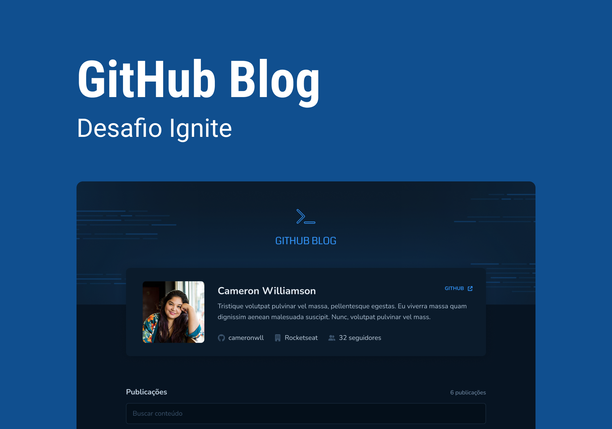

<!-- markdownlint-disable MD033 -->
<!-- markdownlint-disable MD041 -->

   
   
   
   
   
  

 

# Desafio Ignite React - Github Blog

[**Sobre o Projeto**](#sobre-o-projeto) &nbsp;&nbsp;&#124;&nbsp;&nbsp;
[**Deploy**](#deploy) &nbsp;&nbsp;&#124;&nbsp;&nbsp;
[**Tecnologias**](#tecnologias) &nbsp;&nbsp;&#124;&nbsp;&nbsp;
[**Layout**](#layout) &nbsp;&nbsp;&#124;&nbsp;&nbsp;
[**Licença**](#licença)

 

  

## Sobre o Projeto

Nesse desafio, foi desenvolvido uma aplicação que utiliza a API do GitHub para buscar issues de um repositório, dados do seu perfil e exibir elas como um blog.

- Listagem do seu perfil com imagem, número de seguidores, nome e outras informações disponíveis pela API do GitHub.
- Listar e filtrar todas as issues do repositório com um pequeno resumo do conteúdo dela
- Criar uma página para exibir um post (issue) completo

Apesar de serem poucas funcionalidades, foram utlizados conceitos como:

- Fetch / Axios
- Roteamento e React Router DOM
- Formulários

## Deploy

Indisponível.

## Tecnologias

- [`React`](https://reactnative.dev/)
- [`TypeScript`](https://www.typescriptlang.org/)
- [`Vite`](https://vitejs.dev/)
- [`Styled Components`](https://styled-components.com/)
- [`React Hook Form`](https://www.react-hook-form.com/)
- [`React Router DOM`](https://www.npmjs.com/package/react-router-dom)
- [`Zod`](https://zod.dev/)
- [`Phosphor Icons`](https://phosphoricons.com/)
- [`Axios`](https://axios-http.com/ptbr/)
- [`React Syntax Highlighter`](https://github.com/react-syntax-highlighter/react-syntax-highlighter)
- [`react-markdown`](https://remarkjs.github.io/react-markdown/)
- [`moment`](https://www.moment.dev/)

## Layout

Acesse o layout do projeto [`AQUI`](https://www.figma.com/community/file/1138814951106121051).

É necessário ter uma conta no [Figma](https://figma.com) para acessar os layouts.

## Licença

Distribuído sob a licença **_MIT_**. Veja [LICENSE](LICENSE) para mais informações.

## Autor

Feito com ❤️ por [`Marcel Kaled`](https://github.com/mgckaled/).
